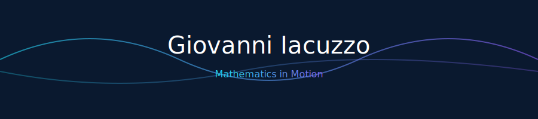

  

<h1 style="font-size: 2.3em; font-weight: 600; color: #EAEAEA;">
  Hi, I'm Giovanni Iacuzzo!
  
</h1>

  🎓 MSc Student in <b>Artificial Intelligence & Cybersecurity Engineering</b> 
  📍 <a href="https://unikore.it" target="_blank" style="color:#8AB6D6; text-decoration:none;">University Kore of Enna</a>

  <em>“Where neural architectures meet mathematical elegance.”</em>

---

## 🧠 About Me

I am a passionate researcher exploring the intersection of  
<b style="color:#8AB6D6;">Artificial Intelligence</b>,  
<b style="color:#8AB6D6;">Mathematical Optimization</b>, and  
<b style="color:#8AB6D6;">Cybersecurity</b>.

My mission is to transform elegant mathematical ideas into intelligent, efficient,  
and secure systems that solve real-world problems.

  
  
  
  

---

## ⚙️ Tech Stack

  

<em>Mathematics + Code = Creativity at Scale</em>

---

## 🧮 Mathematical Mindset

  <h3>∞ <em>“Between equations and intelligence, there lies optimization.”</em> ∞</h3>

$$
\min_{x \in \mathbb{R}^n}\; f(x) \;=\; \|Ax - b\|_2^2 \;+\; \lambda \|x\|_1
$$

---

## 🚀 Selected Projects

  
  

  
  

  <a href="https://github.com/GiovanniIacuzzo?tab=repositories"><b>🔎 Explore all my repositories</b></a>

---

## 📈 GitHub Analytics

   

---

## 🌌 Philosophy

<h3><em>“The beauty of intelligence lies not in its complexity, but in its mathematical simplicity.”</em></h3>

— Where equations become poetry.

---

## 🤝 Connect with Me

Let’s connect — mathematics thrives when shared.

