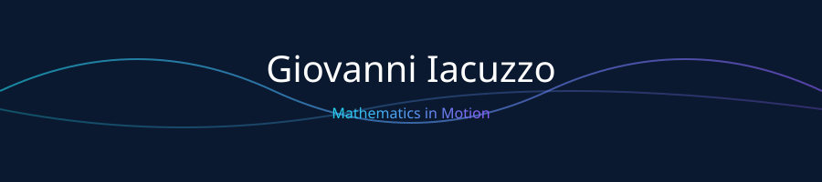

  

<h1 style="font-size: 2.4em; font-weight: 700; color: #EAEAEA; letter-spacing: -0.5px;">
  Hi, I'm Giovanni Iacuzzo
  
</h1>

  🔬 <b>Ph.D. Student</b> in Artificial Intelligence 
  🎓 M.Sc. in <b>Artificial Intelligence & Cybersecurity</b>

  📍 Kore University of Enna

  “At the crossroad of mathematical modeling, operator learning, and evolutionary optimization.”

---

### Research Focus

My research focuses on <b>Scientific Machine Learning (SciML)</b>, <b>Continuous & Evolutionary Optimization</b>, and <b>LLM Robustness</b>. I design data-driven models constrained by physical laws and mathematical rigor to tackle complex engineering systems.

---

### Mathematical Foundations

### CONTINUOUS VARIATIONAL FLOW

$$
\ddot{x}(t) + \frac{\gamma}{t} \dot{x}(t) + \nabla f(x(t)) = 0
$$

*“Optimization is not a destination, but a trajectory through energy landscapes.”*

---

### Research Fuel

  

---

### Connect & Collaborate

  
  
  
  

Open for discussions on mathematical modeling, deep learning architectures, and research collaborations.

  

